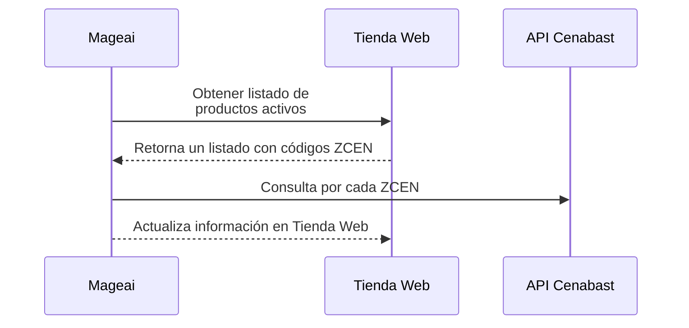

# Resumen
> Your content here
{.is-success}

# Lógica o secuencia

> El siguiente flujo recorre los productos disponibles en la Tienda Web, y luego por cada uno de ellos realiza una consulta para obtener los datos de Stock y fechas de fin de contrato.
{.is-info}

